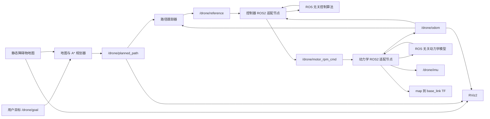

# ROS2 小型无人机仿真器工程规划

> 当前执行范围调整：根据后续要求，本阶段完成除地图之外的全部工作。地图、碰撞检测、避障和依赖障碍物地图的路径规划统一延期；动力学、控制模型、控制算法和 mixer 必须与 ROS2 解耦，地图相关模块未来允许与 ROS2 耦合。下文地图/避障章节保留为后续迭代设计，不属于本阶段完成条件。

## 1. 项目目标与范围

本项目基于 Ubuntu 22.04 和 ROS2 Humble，从零实现一个模块化、可运行、可验证的小型四旋翼无人机仿真系统。

核心交付范围：

1. 输入四路电机转速的六自由度无人机动力学；
2. 输入目标位置、输出四路电机转速的位置与姿态串级控制器；
3. 可配置、可复现的静态障碍物地图；
4. 能够避开静态障碍物的路径规划与局部目标跟踪；
5. 基于 RViz2 的无人机、目标、轨迹、地图和规划路径可视化；
6. 自动记录并绘制位置误差、RPM、轨迹和障碍物距离等实验指标；
7. 完整的 README、AI 使用说明、PDF 报告和演示视频。

虽然原任务把地图与避障标为选做，但最低验收场景包含静态避障和狭窄通道实验。因此，本工程将地图与规划纳入主线范围，但采用复杂度可控的确定性几何地图和栅格 A*，不引入完整 LiDAR 感知或高性能点云仿真。

首版不计划实现多无人机、真实传感器噪声、复杂空气动力学、Web/Qt 地面站和大规模点云渲染。完成并验证基础系统后，可将风扰恢复或传感器噪声作为加分项。

## 2. 设计原则

1. **核心公式自行实现**：参考 `pengyu_sim` 和 MARSIM 的模块组织与接口设计，不复制或包装其实现。
2. **动力学优先**：先验证物理模型和符号约定，再闭环调试控制器，最后接入规划。
3. **SI 单位统一**：内部统一使用 m、s、kg、N、N·m、rad、rad/s；仅在 ROS 电机接口处使用 RPM。
4. **配置与代码分离**：质量、惯量、电机参数、控制增益、地图和规划参数全部放入 YAML。
5. **可复现**：固定仿真步长、随机种子、测试地图和初始状态。
6. **可自动验收**：关键公式有单元测试，完整场景可脚本化启动、记录和生成指标。
7. **显示层与核心解耦**：没有 RViz2 时，动力学、控制和自动测试仍应正常运行。
8. **核心算法与 ROS2 解耦**：动力学模型、数值积分器、位置/姿态控制器和 mixer 必须实现为不依赖 ROS2 的纯 C++ 库；ROS2 节点只负责通信、参数加载、时间调度和数据类型转换。地图、碰撞检测、规划和路径跟踪属于地图相关功能，允许与 ROS2 耦合。

## 3. 推荐仓库结构

```text
drone_sim_ws/
├── README.md
├── ai_usage.md
├── LICENSE
├── src/
│   ├── drone_msgs/             # 自定义消息
│   ├── drone_core/             # ROS 无关的动力学、控制器、mixer 和积分器
│   ├── drone_dynamics/         # 动力学 ROS2 适配节点
│   ├── drone_controller/       # 控制器 ROS2 适配节点
│   ├── drone_map/              # 静态几何障碍物地图
│   ├── drone_planner/          # A*、路径简化和局部目标跟踪
│   ├── drone_visualization/    # 无人机和状态 Marker
│   └── drone_bringup/          # launch、参数和 RViz 配置
├── config/                     # 公共参数和实验场景
├── scripts/                    # 自动实验、数据处理和绘图
├── test/                       # 集成测试入口
├── report/                     # 报告源码、图片和最终 PDF
└── media/                      # README 截图和演示素材
```

核心动力学和控制器使用 C++17 与 Eigen；实验控制、数据分析和绘图使用 Python 3。`drone_core` 可以通过 `ament_cmake` 打包，但其公开头文件和实现不得包含 ROS2 头文件或 ROS 消息类型。

### 3.1 核心算法与 ROS2 的依赖边界

`drone_core` 只允许依赖 C++ 标准库和 Eigen，至少包含以下独立组件：

```text
drone_core/
├── include/drone_core/
│   ├── types.hpp               # State、Parameters、Reference、MotorCommand
│   ├── motor_model.hpp         # 电机一阶响应
│   ├── quadrotor_model.hpp     # 六自由度状态导数和推进
│   ├── integrator.hpp          # 半隐式 Euler/RK4
│   ├── position_controller.hpp # 位置外环
│   ├── attitude_controller.hpp # 姿态内环
│   └── mixer.hpp               # 力/力矩到电机转速
├── src/
└── test/                       # 不启动 ROS2 的算法单元测试
```

核心库中禁止出现：

- `rclcpp`、ROS publisher/subscriber、ROS logger；
- `geometry_msgs`、`nav_msgs`、`sensor_msgs` 等 ROS 消息；
- ROS parameter、ROS time 和 TF 类型；
- topic 名称、frame 名称或 launch 相关逻辑。

核心 API 使用普通结构体、Eigen 类型和显式 `dt`，例如：

```cpp
State QuadrotorModel::step(
  const State & state,
  const MotorCommand & command,
  double dt);

ControlOutput PositionAttitudeController::compute(
  const State & state,
  const Reference & reference,
  double dt);
```

ROS2 适配节点承担：

1. ROS 消息与核心结构体之间的双向转换；
2. 从 YAML/ROS parameter 构造核心参数对象；
3. timer、topic、service、QoS、TF 和日志；
4. 对时间戳、frame_id 和通信异常进行处理；
5. 调用核心库，但不重复实现动力学或控制公式。

依赖方向必须保持单向：

```text
ROS2 node/adaptor  --->  drone_core  --->  Eigen / C++ STL
```

`drone_core` 不得反向依赖任何 ROS2 package。地图、障碍物表示、A*、路径简化和局部路径跟踪允许直接使用 ROS2 消息与参数，因为这些属于地图相关模块；如果后续需要复用，也可以再逐步拆出纯算法库，但不作为首版硬性要求。

## 4. 系统架构与数据流



规划器应提供两种模式：

- `planning_enabled=true`：目标经过碰撞检测、A* 和路径跟踪后送入控制器；
- `planning_enabled=false`：目标直接作为控制器参考，便于单独调试动力学和控制器。

## 5. ROS2 接口规划

| 名称 | 类型 | 发布者 | 订阅者 | 说明 |
|---|---|---|---|---|
| `/drone/motor_rpm_cmd` | `drone_msgs/msg/MotorRPM` | 控制器 | 动力学 | 四路期望 RPM |
| `/drone/motor_rpm` | `drone_msgs/msg/MotorRPM` | 动力学 | 可视化/评测 | 一阶响应后的实际 RPM |
| `/drone/odom` | `nav_msgs/msg/Odometry` | 动力学 | 控制器/规划器/评测 | 无人机完整状态 |
| `/drone/imu` | `sensor_msgs/msg/Imu` | 动力学 | 可视化/评测 | 简化 IMU 真值或带噪输出 |
| `/tf` | `tf2_msgs/msg/TFMessage` | 动力学 | RViz2 | `map -> base_link` |
| `/drone/path` | `nav_msgs/msg/Path` | 动力学 | RViz2 | 实际历史轨迹 |
| `/drone/goal` | `geometry_msgs/msg/PoseStamped` | 用户/RViz2 | 规划器 | 最终目标位置和 yaw |
| `/drone/reference` | `geometry_msgs/msg/PoseStamped` | 路径跟踪器 | 控制器 | 当前安全局部目标 |
| `/drone/planned_path` | `nav_msgs/msg/Path` | 规划器 | 路径跟踪器/RViz2 | 简化后的安全路径 |
| `/map/obstacles` | `drone_msgs/msg/ObstacleArray` | 地图节点 | 规划器 | 结构化障碍物数据 |
| `/map/obstacle_markers` | `visualization_msgs/msg/MarkerArray` | 地图节点 | RViz2 | 障碍物显示 |
| `/drone/planner_status` | `std_msgs/msg/String` | 规划器 | RViz2/评测 | 成功、无解或目标非法等状态 |

建议自定义消息：

```text
MotorRPM.msg
std_msgs/Header header
float64[4] rpm

Obstacle.msg
uint8 BOX=0
uint8 CYLINDER=1
uint8 type
geometry_msgs/Pose pose
geometry_msgs/Vector3 size

ObstacleArray.msg
std_msgs/Header header
Obstacle[] obstacles
```

另外提供 `/drone/reset` 服务，用于重置状态和批量执行实验。

## 6. 坐标系与电机约定

开始实现前必须将下列约定写入代码注释和 README，后续禁止隐式改变：

1. 世界坐标系采用 ROS ENU：x 向东/前、y 向北/左、z 向上；
2. 机体坐标系采用 ROS FLU：x 向前、y 向左、z 向上；
3. 姿态四元数表示机体系到世界系的旋转；
4. 重力在世界系中为 `[0, 0, -g]`；
5. 机体总升力沿机体 `+z` 方向；
6. 明确 X 型四旋翼四个电机的位置、编号和旋转方向；
7. 明确正 roll、pitch、yaw 力矩对应的电机增减速关系。

建议在代码中集中定义电机布局矩阵，禁止在动力学和 mixer 中分别硬编码两套符号。使用单电机测试和纯 roll/pitch/yaw mixer 测试验证约定，避免出现无人机起飞后立即翻转的问题。

## 7. 动力学模块设计

本节公式全部实现在 `drone_core` 中。`drone_dynamics` 节点只进行 RPM 消息转换、参数装配、定时调用、状态发布和 TF 广播，不包含第二套动力学计算。

### 7.1 状态

动力学状态包含：

- 世界系位置 `p`；
- 世界系速度 `v`；
- 姿态四元数 `q`；
- 机体系角速度 `Omega`；
- 四个电机实际角速度 `omega_i`。

建议动力学更新频率为 200 Hz，使用 ROS steady timer 或显式固定 `dt`。首版使用半隐式 Euler；如果测试显示姿态积分误差明显，再升级为 RK4。

### 7.2 电机模型

ROS 接口接收 RPM，进入动力学后转换为 rad/s：

```text
omega = RPM * 2*pi / 60
```

电机一阶响应：

```text
omega_dot_i = (omega_cmd_i - omega_i) / tau_motor
```

对命令和实际转速均执行上下限保护。

### 7.3 推力和力矩

单电机推力与反扭矩：

```text
F_i = k_F * omega_i^2
M_i = k_M * omega_i^2
```

X 型布局产生总推力及三轴力矩。位置和电机旋转方向应由同一布局矩阵生成。

### 7.4 平动与转动

```text
p_dot = v
m * v_dot = R(q) * [0, 0, T]^T + [0, 0, -m*g]^T + F_external
I * Omega_dot = tau - Omega x (I * Omega)
```

姿态通过四元数运动学积分，每次更新后强制归一化。节点还需检测非有限数、过大速度和异常姿态；检测到严重异常时进入安全状态并允许重置。

### 7.5 地面模型

首版采用简化地面约束：当无人机低于地面且垂向速度向下时，将高度和垂向速度截断，并抑制穿透。无需实现完整接触力学，但应保证起飞前不会数值下沉。

### 7.6 默认参数

配置文件至少包含：

- 质量和重力加速度；
- 三轴惯量；
- 机臂长度；
- `k_F`、`k_M`；
- 电机时间常数；
- 最小/最大 RPM；
- 仿真频率和轨迹保留长度；
- 可选外力/风扰参数。

理论悬停转速由下式计算：

```text
RPM_hover = 60/(2*pi) * sqrt(m*g/(4*k_F))
```

该值应由工具或启动日志自动输出，不能只依赖人工试凑。

## 8. 控制器模块设计

本节的位置环、姿态环、限幅、anti-windup 和 mixer 全部实现在 `drone_core` 中。`drone_controller` 节点只将 odometry 和 reference 转换为核心结构体，再把核心输出转换为 `MotorRPM` 消息。

### 8.1 控制结构

采用位置外环和姿态内环的串级控制器：

1. 位置误差生成期望加速度；
2. 期望加速度和期望 yaw 生成期望姿态；
3. 姿态误差和角速度误差生成三轴力矩；
4. 总推力与三轴力矩通过 mixer 转换为四个电机转速。

控制器建议运行在 100 Hz。

### 8.2 位置环

```text
a_cmd = Kp * (p_ref - p)
      + Kd * (v_ref - v)
      + Ki * integral(position_error)
      + gravity_compensation
```

需实现：

- 位置误差限幅；
- 参考速度和加速度限幅；
- 最大水平倾角限制；
- 积分限幅和 anti-windup；
- 目标跳变时的参考平滑；
- 目标过远时限速，而不是直接放大控制量。

调试顺序为垂向控制、姿态稳定、水平位置控制，禁止一开始同时调所有增益。

### 8.3 期望姿态与姿态环

利用期望合力方向构造期望机体 z 轴，再结合期望 yaw 构造完整期望旋转矩阵。姿态误差建议使用旋转矩阵或四元数误差，避免欧拉角奇异性；日志和报告中仍输出期望 roll、pitch、yaw，便于解释和绘图。

姿态环输出：

```text
tau = -K_R * attitude_error - K_Omega * angular_rate_error
```

总推力取期望合力在当前机体升力方向上的投影，并执行非负和最大推力限制。

### 8.4 Mixer

定义统一分配矩阵：

```text
[T, tau_x, tau_y, tau_z]^T = A * [omega_1^2, omega_2^2, omega_3^2, omega_4^2]^T
```

通过 `A` 的逆或受限分配求出各电机平方转速，再执行非负截断、开方、rad/s 到 RPM 转换和 RPM 限幅。

需要单独测试：

- 等转速只产生升力；
- 纯 roll、pitch、yaw 指令产生正确符号的力矩；
- mixer 正向和逆向计算一致；
- 饱和情况下不产生 NaN。

## 9. 地图模块设计

首版使用 YAML 定义的立方体和圆柱体静态障碍物。地图必须：

1. 支持固定随机种子；
2. 默认场景包含不少于 5 个障碍物；
3. 障碍物位于起点和目标之间，迫使无人机绕行；
4. 同时发布结构化障碍物数据和 RViz Marker；
5. 在 README 中说明地图边界、坐标系、障碍物尺寸、无人机半径和安全距离。

至少准备两套地图：

- `five_obstacles.yaml`：普通绕行场景；
- `narrow_passage.yaml`：具有明显绕行或狭窄通道的场景。

## 10. 规划与路径跟踪设计

### 10.1 碰撞模型

将无人机近似为球体。规划前按以下半径膨胀障碍物：

```text
inflation_radius = drone_radius + safety_margin
```

规划路径、简化路径和局部参考点均需执行一致的碰撞检测。

### 10.2 A* 规划

首版采用三维体素 A*：

- 默认分辨率 0.25 m；
- 26 邻接；
- 欧氏距离启发函数；
- 有限地图边界；
- 支持起点、目标点占用检查；
- 支持最大搜索节点数和超时；
- 使用视线碰撞检测简化阶梯状路径。

如果开发周期不足，可先实现固定高度二维 A*，但正式避障场景仍需维持目标高度，并在 README 和报告中明确其适用范围。

### 10.3 路径跟踪

路径跟踪器根据当前位置，在规划路径前方选择具有可配置前视距离的 waypoint，发布 `/drone/reference`。需限制参考速度，并避免直接追踪过远 waypoint 导致切角撞击膨胀障碍物。

### 10.4 失败处理

以下情况不得继续发送危险参考：

- 目标在地图边界外；
- 起点或目标在膨胀障碍物内；
- 搜索超时或无路径；
- 地图数据无效；
- 无人机偏离路径且重规划失败。

失败时保持当前安全位置，发布明确状态，并在日志中说明原因。

## 11. 可视化与实验工具

RViz2 配置至少显示：

1. 无人机模型或 Marker；
2. 目标点和当前局部目标；
3. 实际历史轨迹；
4. 原始障碍物及其安全膨胀范围；
5. 规划路径；
6. Odometry、TF 和坐标轴；
7. 规划成功、失败或避障激活状态。

Python 评测工具订阅或读取 rosbag，自动生成：

- x/y/z 位置与误差曲线；
- 四路命令和实际 RPM 曲线；
- roll/pitch/yaw 曲线；
- 三维实际轨迹和规划路径；
- 最小障碍物净距曲线；
- 到达时间、最大超调、稳态误差、路径长度和 RPM 饱和比例。

## 12. 测试计划

### 12.1 单元测试

| 测试对象 | 测试内容 | 通过标准 |
|---|---|---|
| 电机响应 | 阶跃命令的一阶响应 | 数值结果符合时间常数且不越界 |
| 推力模型 | 指定转速的推力 | 与 `k_F*omega^2` 一致 |
| 电机布局 | 等转速和单电机输入 | 总力与各轴力矩符号正确 |
| 四元数积分 | 静止和固定角速度 | 范数接近 1，旋转方向正确 |
| 悬停平衡 | 理论悬停 RPM | 合力接近 0、力矩接近 0 |
| Mixer | 控制量与电机分配往返 | 数值误差在容差内 |
| 障碍物膨胀 | 边界点碰撞检测 | 内外判断正确 |
| A* | 空地图、阻挡、无解场景 | 路径有效且不穿障碍物 |

### 12.2 ROS2 集成测试

- 所有节点能由统一 launch 启动；
- topic 类型、frame_id 和频率符合约定；
- 关闭控制器时可直接发送 RPM；
- 关闭规划器时可直接追踪目标；
- reset 后状态和轨迹正确清空；
- 非法 RPM、非法目标和规划失败不会造成崩溃；
- 无 RViz2 的 headless 模式可运行完整实验。

### 12.3 最低验收场景

| 场景 | 主要指标 | 建议通过标准 |
|---|---|---|
| 悬停 `(0,0,1.5)` | 稳态误差、姿态、RPM | 最终误差小于 0.3 m，无姿态发散 |
| 目标点 `(2,1,1.5)` | 到达时间、超调 | 成功到达并稳定悬停 |
| 正方形航线 | 每个 waypoint 状态 | 连续完成 3 至 4 个目标点 |
| 五障碍绕行 | 最小净距、路径长度 | 无碰撞，净距大于安全距离 |
| 狭窄通道 | 规划状态和实际轨迹 | 成功通过或安全报告无解 |
| 目标突变/扰动 | 恢复时间、RPM | 不翻转、不产生 NaN、不长期饱和 |

## 13. 分阶段实施计划

### 阶段 0：工程骨架（约 0.5 天）

- 创建 ROS2 packages、自定义消息和统一 launch；
- 建立参数、坐标系、电机编号和 topic 约定；
- 添加 `.gitignore`、许可证、基础 README 和 CI；
- 验证空工程能够 `colcon build` 和一键启动。

阶段完成标准：在干净终端中可按 README 命令构建，所有占位节点和消息接口正常。

### 阶段 1：动力学（约 1.5 至 2 天）

- 实现电机响应、推力/力矩和六自由度积分；
- 发布 odom、imu、tf、path 和实际 RPM；
- 实现地面约束、状态保护和 reset；
- 完成理论悬停、力矩符号和四元数单元测试。

阶段完成标准：直接发送四路悬停 RPM 时，无人机不翻转、不数值发散，四元数范数保持接近 1。

### 阶段 2：控制器（约 2 天）

- 先调通高度控制；
- 再调通姿态稳定；
- 最后接入水平位置控制和完整 mixer；
- 添加限幅、anti-windup 和目标跳变保护。

阶段完成标准：完成悬停和 `(2,1,1.5)` 点到点实验，最终位置误差小于 0.3 m，且无长期 RPM 饱和。

### 阶段 3：多目标与可视化（约 1 天）

- 实现 waypoint 队列和到达判定；
- 配置 RViz2；
- 完成正方形航线；
- 开始自动记录指标。

阶段完成标准：不重启节点即可连续飞完 3 至 4 个目标点。

### 阶段 4：地图与避障（约 2 天）

- 实现 YAML 静态地图；
- 实现障碍物膨胀、A*、路径简化和路径跟踪；
- 添加普通绕行和狭窄通道地图；
- 可视化规划路径、膨胀边界和局部目标。

阶段完成标准：实际轨迹不穿越障碍物，最小净距大于安全距离，无解时安全悬停。

### 阶段 5：自动测试与鲁棒性（约 1 至 1.5 天）

- 完善单元测试和 launch 集成测试；
- 自动计算全部验收指标；
- 测试质量、初始姿态和控制增益的小范围变化；
- 测试非法输入、目标跳变和规划失败。

阶段完成标准：一条命令可执行主要场景并输出数据和图表，重复运行结果一致。

### 阶段 6：交付材料（约 1 至 2 天）

- 完善 README 和 `ai_usage.md`；
- 编写 6 至 10 页 PDF 报告；
- 录制 1 至 3 分钟演示视频；
- 在干净环境重新构建和执行所有场景；
- 整理公开 Git 仓库、提交记录和发布标签。

预计总开发量为 8 至 10 个有效工作日。时间不足时，应优先保证阶段 0 至阶段 3，并将三维 A* 降级为固定高度二维 A*；不得为了复杂地图牺牲动力学和控制稳定性。

## 14. Git 工作方式

建议每个可验证小目标单独提交，提交顺序可为：

1. `chore: scaffold ros2 workspace and packages`
2. `feat: add quadrotor motor and rigid body dynamics`
3. `test: verify hover thrust and motor mixer signs`
4. `feat: add cascaded position attitude controller`
5. `feat: add rviz visualization and waypoint mission`
6. `feat: add deterministic obstacle map`
7. `feat: add inflated-grid astar planner`
8. `test: add automated acceptance scenarios`
9. `docs: add report figures and usage guide`

避免把生成物、rosbag、大型视频、`build/`、`install/` 和 `log/` 提交到 Git。报告图片可以提交，原始实验数据应控制体积或放入 release。

## 15. 文档与最终交付

### 15.1 README

README 至少包括：

- 项目功能和演示 GIF/截图；
- 支持的 Ubuntu/ROS2 版本；
- 依赖安装、构建和一键启动命令；
- 节点、topic、frame 和参数说明；
- 电机编号、旋转方向和坐标系图；
- 五个验收场景的运行命令；
- 指标表和主要实验图；
- 已知限制和故障排查；
- 与参考仓库的关系及许可证说明。

### 15.2 AI 使用说明

`ai_usage.md` 至少记录：

- 使用的 AI 工具；
- 不少于 8 条关键 prompt 或交互摘要；
- AI 参与的模块；
- 人工确认或修改的公式、坐标系和接口；
- AI 产生过的错误、发现过程和修复方式；
- 动力学、控制器、规划器和 ROS2 topic 的验证方法。

建议从开发第一天持续记录，不在项目结束时补写。

### 15.3 PDF 报告

报告建议结构：

1. 任务背景与系统目标；
2. 系统架构和 ROS2 数据流；
3. 六自由度动力学与电机模型；
4. 串级控制器与 mixer；
5. 地图、障碍物膨胀、A* 和路径跟踪；
6. 可视化与自动评测方法；
7. 实验结果、指标表和失败案例；
8. 与参考项目的差异；
9. AI 使用说明；
10. 局限与后续工作。

### 15.4 演示视频

1 至 3 分钟视频建议按以下节奏录制：

1. 10 秒：仓库结构和一键启动；
2. 20 秒：悬停和目标点飞行；
3. 20 秒：正方形多目标点；
4. 30 至 60 秒：五障碍绕行和狭窄通道；
5. 15 秒：误差、RPM 和最小障碍物距离曲线；
6. 10 秒：总结指标和已知限制。

## 16. 主要风险与对策

| 风险 | 影响 | 对策 |
|---|---|---|
| 坐标系或 mixer 符号错误 | 起飞后立即翻转 | 集中定义布局矩阵，先做纯轴力矩单元测试 |
| RPM 与 rad/s 混用 | 推力量级完全错误 | 接口边界统一转换，内部只用 rad/s |
| 参数物理量不匹配 | 无法悬停或严重饱和 | 自动计算理论悬停 RPM，并检查推重比 |
| 同时调多个控制环 | 难以定位振荡来源 | 按垂向、姿态、水平位置逐层闭环 |
| A* 安全但实际轨迹切角 | 实际碰撞 | 膨胀障碍物、限制速度、局部目标碰撞复检 |
| 规划分辨率过高 | 搜索慢或内存过大 | 有限边界、节点上限、超时和可配置分辨率 |
| RViz/WSLg 环境异常 | 无法显示演示 | 核心节点支持 headless，单独排查显示层 |
| 参考项目许可证污染 | 不适合独立发布 | 只参考思路，自行重写并注明引用和差异 |
| 最后集中补文档 | 缺少真实实验和 AI 记录 | 每阶段同步更新 README、图表和 ai_usage |

## 17. 可选加分项优先级

完成所有最低验收后，按以下顺序选择加分项：

1. 风扰或外力注入，以及控制器恢复曲线；
2. 可配置 IMU 噪声和偏置；
3. GitHub Actions/容器化自动构建；
4. 圆轨迹或八字轨迹跟踪；
5. 更高阶积分器和积分误差对比；
6. 点云或体素局部感知模拟；
7. 多无人机或独立地面站。

首选风扰恢复，因为它改动小、物理意义明确，并能直接展示控制器稳定性。

## 18. 完成定义

工程只有同时满足以下条件才视为完成：

- 干净的 Ubuntu 22.04 + ROS2 Humble 环境可按 README 构建；
- 一条 launch 命令可启动完整系统；
- 动力学、控制器、地图、规划器和 RViz2 均有清晰模块边界；
- 动力学模型、积分器、控制算法和 mixer 不依赖 ROS2，可在不启动 ROS2 的情况下独立编译并运行单元测试；
- ROS2 适配节点只负责通信、配置、调度和类型转换，不重复实现核心公式；
- 悬停、目标点、多目标点、五障碍绕行和狭窄通道场景均有可复现命令；
- 目标点最终误差小于 0.3 m；
- 避障实验最小净距大于配置的安全距离；
- 无姿态发散、NaN 或不可解释的长期 RPM 饱和；
- 自动生成轨迹、误差、RPM 和最小距离图；
- README、`ai_usage.md`、PDF 报告和演示视频齐全；
- 公开 Git 仓库具有清晰、可审阅的提交历史。
