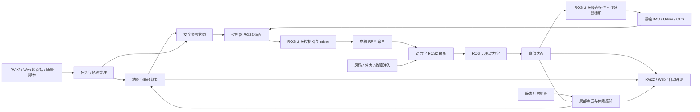

# ROS2 小型无人机仿真器工程规划

> 最新范围：任务文档“加分项”中的 10 个方向全部升级为必做项。除基础动力学、控制、地图、规划、RViz2 和交付材料外，工程还必须完成全量 YAML 配置、风扰、传感器噪声、点云/体素局部感知、多无人机、圆/八字/航点轨迹、自动评测、Web 地面站、参考项目对比，以及选定的创新扩展。
>
> 解耦边界保持不变：动力学模型、数值积分、控制算法、控制模型、mixer、轨迹生成和扰动/传感器数学模型不得依赖 ROS2；ROS2 节点只负责通信、配置、调度和类型转换。地图、碰撞检测、点云/体素、局部感知和基于地图的规划允许与 ROS2 耦合。

## 当前实施状态（2026-07-23）

规划中的工程内工作已经完成并进入交付复核：

- 10 项加分方向全部实现：全量 YAML、风扰、传感器噪声、局部点云/体素、三机、多轨迹、自动评测、Web 地面站、参考对比，以及故障/回放/参数扫描创新扩展；
- 11 个正式场景已自动运行并全部通过阈值验收，结果保存在 `artifacts/experiments/`；
- 已完成运行稳定性专项优化：阻止重复仿真栈、拆分物理积分与 ROS 发布频率、限制轨迹历史、修复规划路径倒退和终点折返，并将所有经过时间/超时/限流逻辑改用单调时钟，适应 WSL 系统时间校正；
- `drone_core` 可脱离 ROS2 独立构建测试，控制、动力学、轨迹、扰动和噪声数学模型保持 ROS2 解耦；
- 15 个 ROS2 package 已完成全量构建，测试汇总为 35 tests、0 error、0 failure、0 skipped；
- 三机最小实测间距 0.786 m（阈值 0.75 m），Web API 的状态、结果、目标、扰动、故障和 reset 操作均通过；
- 独立模式管理 Panel 已覆盖 5 种运行模式、11 个场景、RViz 开关、实时日志、结果浏览和全部 29 份 YAML；保存参数时执行跨配置校验，失败自动回滚；
- 3×3 控制增益/风扰参数扫描及 wind 场景确定性回放已生成结果；
- README、参数指南、完成性审计和参考项目对比已同步。PDF/视频由仓库脚本从同一批实测数据重新生成并做可视检查；
- 唯一需要仓库所有者外部账号权限的事项是创建公开 Git 远端并推送，工程内不擅自代建或发布。

详细证据和复核命令见 `docs/completion_audit.md`。以下章节保留完整设计、验收合同与阶段计划，作为实现追溯依据。

## 1. 项目目标与硬性范围

项目基于 Ubuntu 22.04 与 ROS2 Humble，从零实现模块化、可运行、可复现、可自动验收的小型四旋翼无人机仿真系统。

最终交付必须包含：

1. 输入四路电机转速的六自由度刚体动力学和电机一阶模型；
2. 输入目标状态、输出四路电机转速的位置—姿态串级控制器；
3. YAML 静态地图、碰撞检测、障碍物膨胀、A* 与路径跟踪；
4. RViz2 中的无人机模型、目标、轨迹、地图、点云、体素和规划路径；
5. 质量、惯量、电机参数、控制增益、地图、规划、噪声和实验参数的 YAML 配置；
6. 可配置风场与外力扰动，以及扰动恢复实验；
7. IMU、里程计/GPS 简化噪声、偏置和随机游走模型；
8. 有视场、量程、刷新率和噪声的局部点云感知，以及体素占用地图；
9. 至少 3 架无人机的独立命名空间运行、共同任务和安全间距监测；
10. 圆轨迹、八字轨迹和 YAML 航点列表三类轨迹任务；
11. 算法单元测试、ROS2 集成测试和一键批量评测；
12. 可启动、可监控、可发任务和可展示曲线的轻量 Web 地面站；
13. 与 `pengyu_sim`、MARSIM 的架构、模型和实验结果对比；
14. 创新扩展：电机故障/通信异常注入、确定性回放和参数批量扫描；
15. README、AI 使用说明、6 至 10 页 PDF 报告、1 至 3 分钟视频和公开 Git 仓库。

上述功能均属于完成条件，不再使用“可选”“时间不足则裁剪”或“后续再做”的范围降级策略。实现复杂度通过简化且明确的物理模型、有限地图边界和确定性实验控制。

## 2. 总体设计原则

1. **核心公式自行实现**：参考项目只用于架构和结果对比，不复制或包装其核心实现。
2. **算法与 ROS2 解耦**：非地图类数学模型使用普通 C++、Eigen 和显式 `dt`，可脱离 ROS2 编译测试。
3. **地图侧允许耦合**：地图、点云、体素、碰撞检测和路径规划可直接使用 ROS2 消息、参数与 TF。
4. **SI 单位统一**：核心内部使用 m、s、kg、N、N·m、rad、rad/s；RPM 只存在于 ROS 电机接口边界。
5. **配置与代码分离**：所有影响运行结果的参数必须来自 YAML；代码内只保留经说明的安全默认值。
6. **可复现**：固定步长、随机种子、初始状态、场景版本和配置快照；批量实验输出运行清单。
7. **分层验证**：公式单元测试通过后才接 ROS2，再接闭环控制、规划、感知、多机和地面站。
8. **无界面可运行**：RViz2 与 Web 地面站关闭时，仿真和自动评测仍能完整执行。
9. **证据驱动验收**：每项功能都必须有启动命令、自动检查、指标文件和至少一张图或录屏证据。

## 3. 仓库与模块结构

```text
drone_sim_ws/
├── README.md
├── ai_usage.md
├── LICENSE
├── src/
│   ├── drone_msgs/              # 自定义消息、服务和动作
│   ├── drone_core/              # ROS 无关：动力学、控制、mixer、轨迹、扰动、噪声数学模型
│   ├── drone_dynamics/          # 动力学 ROS2 适配节点
│   ├── drone_controller/        # 控制器 ROS2 适配节点
│   ├── drone_trajectory/        # 轨迹任务 ROS2 适配与任务管理
│   ├── drone_sensors/           # IMU/GPS/里程计带噪输出适配节点
│   ├── drone_map/               # 静态几何地图和 Marker
│   ├── drone_perception/        # 局部点云、体素地图和感知范围模拟
│   ├── drone_planner/           # 碰撞检测、A*、简化和路径跟踪
│   ├── drone_fleet/             # 多机生成、任务编排和安全间距监测
│   ├── drone_visualization/     # 无人机、状态和实验 Marker
│   ├── drone_ground_station/    # Web 服务、ROS bridge 和静态前端
│   ├── drone_evaluation/        # 场景运行、rosbag、指标、绘图和报告汇总
│   └── drone_bringup/           # launch、YAML、RViz 和场景入口
├── config/
│   ├── vehicle/                 # 机体、电机、控制器
│   ├── environment/             # 地图、风场、传感器和故障
│   ├── missions/                # 目标点、圆、八字、航点和多机任务
│   └── scenarios/               # 可直接执行的完整实验配置
├── scripts/                     # 构建、启动、批量评测和环境检查
├── test/                        # 跨 package 集成测试
├── report/                      # 报告源码、图和最终 PDF
└── media/                       # README 与视频素材
```

核心计算采用 C++17 与 Eigen；评测和 Web 后端使用 Python 3。前端采用轻量 HTML/CSS/JavaScript，不依赖桌面 Qt 环境。

### 3.1 ROS 无关核心边界

`drone_core` 至少包含：

```text
include/drone_core/
├── types.hpp
├── motor_model.hpp
├── quadrotor_model.hpp
├── integrator.hpp
├── disturbance_model.hpp
├── sensor_noise_model.hpp
├── position_controller.hpp
├── attitude_controller.hpp
├── mixer.hpp
└── trajectory_generator.hpp
```

核心库禁止包含 `rclcpp`、ROS 消息、ROS parameter、ROS time、TF、topic/frame 名称和 launch 逻辑。API 使用普通结构体、Eigen 类型、显式时间与随机数种子，例如：

```cpp
State QuadrotorModel::step(
  const State &state,
  const MotorCommand &command,
  const ExternalWrench &disturbance,
  double dt);

ControlOutput Controller::compute(
  const State &state,
  const Reference &reference,
  double dt);

TrajectorySample TrajectoryGenerator::sample(double t) const;
```

依赖方向固定为：

```text
ROS2 adaptor/node  --->  drone_core  --->  Eigen / C++ STL
```

ROS2 适配层只负责消息转换、YAML 参数装配、timer、QoS、TF、日志、生命周期和异常处理，不得复制核心公式。地图相关模块允许直接依赖 ROS2；多机模块只编排多个单机实例，不侵入核心算法。

## 4. 系统架构与数据流



单机链路以命名空间实例化为 `/drone_0`、`/drone_1`、`/drone_2`。共享地图使用 `/map`，每架无人机拥有独立状态、控制器、传感器、轨迹、TF 前缀和随机种子。`drone_fleet` 只下发任务、汇总状态并监测机间距离。

规划提供两种模式：

- `planning_enabled=true`：目标经地图/局部体素碰撞检查、A* 和路径跟踪后进入控制器；
- `planning_enabled=false`：圆、八字或航点轨迹直接生成控制参考，用于控制与轨迹实验。

## 5. ROS2 接口规划

下表中的 `{id}` 代表单机实例，例如 `drone_0`。

| 名称 | 类型 | 说明 |
|---|---|---|
| `/{id}/motor_rpm_cmd` | `drone_msgs/msg/MotorRPM` | 四路期望 RPM |
| `/{id}/motor_rpm` | `drone_msgs/msg/MotorRPM` | 一阶响应后的实际 RPM |
| `/{id}/truth/odom` | `nav_msgs/msg/Odometry` | 动力学真值，仅仿真/评测使用 |
| `/{id}/odom` | `nav_msgs/msg/Odometry` | 可配置带噪状态，供控制与规划使用 |
| `/{id}/imu` | `sensor_msgs/msg/Imu` | 带噪、偏置和协方差的 IMU |
| `/{id}/gps` | `sensor_msgs/msg/NavSatFix` 或简化位置消息 | 低频带噪位置 |
| `/{id}/goal` | `geometry_msgs/msg/PoseStamped` | 最终目标位置和 yaw |
| `/{id}/reference` | `drone_msgs/msg/TrajectoryPoint` | 位置、速度、加速度和 yaw 参考 |
| `/{id}/planned_path` | `nav_msgs/msg/Path` | 安全路径 |
| `/{id}/actual_path` | `nav_msgs/msg/Path` | 实际历史轨迹 |
| `/{id}/local_points` | `sensor_msgs/msg/PointCloud2` | 局部视场点云 |
| `/{id}/voxel_map` | `sensor_msgs/msg/PointCloud2` 或 `MarkerArray` | 体素占用结果 |
| `/{id}/disturbance` | `geometry_msgs/msg/WrenchStamped` | 当前外力/外力矩真值 |
| `/{id}/status` | `drone_msgs/msg/DroneStatus` | 模式、健康、到达和故障状态 |
| `/map/obstacles` | `drone_msgs/msg/ObstacleArray` | 结构化静态障碍物 |
| `/map/obstacle_markers` | `visualization_msgs/msg/MarkerArray` | 地图可视化 |
| `/fleet/status` | `drone_msgs/msg/FleetStatus` | 多机汇总与最小机间距 |
| `/evaluation/status` | `drone_msgs/msg/EvaluationStatus` | 当前场景、进度和指标状态 |

服务/动作至少包括：

- `/{id}/reset`：按场景配置重置单机状态；
- `/{id}/set_mission`：下发点、航点、圆或八字任务；
- `/fleet/reset` 与 `/fleet/set_mission`：同步管理多机任务；
- `/fault/inject` 与 `/fault/clear`：注入/清除确定性故障；
- `/evaluation/run_scenario`：启动一次自动评测。

所有消息必须携带一致的时间戳和 `frame_id`。QoS 由 YAML 配置；真值、控制和传感器流默认使用适合高频数据的配置，地图与状态使用 transient-local，避免 RViz2 晚订阅导致模型或地图丢失。

## 6. 坐标系、电机和多机命名约定

1. 世界坐标系使用 ROS ENU，机体系使用 ROS FLU；
2. 姿态四元数表示机体系到世界系的旋转；重力为 `[0,0,-g]`，升力沿机体 `+z`；
3. X 型四旋翼的电机位置、编号、旋向和力矩符号由一个布局矩阵集中定义；
4. 多机共享 `map`，机体帧为 `{id}/base_link`，传感器帧同样带 `{id}` 前缀；
5. frame、topic 和 Marker namespace 不得硬编码 `drone`，必须由实例 ID 生成；
6. 单电机、等转速、纯 roll/pitch/yaw 和多机 TF 冲突都必须有自动测试。

## 7. 动力学、扰动与故障设计

### 7.1 六自由度模型

状态包含世界系位置/速度、姿态四元数、机体系角速度和四路实际电机角速度。默认动力学频率 200 Hz，支持半隐式 Euler 与 RK4 通过 YAML 切换。

```text
omega_dot_i = (omega_cmd_i - omega_i) / tau_motor
F_i = k_F * omega_i^2
M_i = k_M * omega_i^2
p_dot = v
m * v_dot = R(q) * [0,0,T]^T + [0,0,-m*g]^T + F_drag + F_external
I * Omega_dot = tau + tau_external - Omega x (I * Omega)
```

每步对四元数归一化，并检测非有限数、速度/角速度越界和地面穿透。理论悬停 RPM 由参数自动计算并在启动与评测报告中记录。

### 7.2 风场和外力

扰动模型放在 `drone_core`，ROS 节点只选择配置和发布真值。至少实现：

- 常值风；
- 正弦风；
- 指定开始时间、持续时间和方向的阵风；
- 固定随机种子的带限随机风；
- 世界系外力与机体系外力矩阶跃；
- 与相对气流相关的简化二次阻力。

扰动验收记录峰值偏差、恢复时间、稳态误差和 RPM 饱和比例。相同种子重复运行的指标差异必须在容差内。

### 7.3 创新故障注入

实现以下可脚本化故障：

- 单电机效率衰减、转速上限降低和短时失效；
- 传感器消息丢包、延迟、冻结与偏置阶跃；
- 控制指令延迟或保持；
- 故障按时间表注入、清除和回放。

故障场景必须区分“控制器可恢复”和“物理上不可恢复”两类；不可恢复时要求安全降落/停止命令并明确报告，不能以不坠毁作为不现实的硬指标。

## 8. 控制器与轨迹设计

### 8.1 串级控制器

位置外环生成期望加速度，结合期望 yaw 构造期望姿态；姿态内环生成力矩；mixer 将总推力和三轴力矩分配为四路 RPM。

```text
a_cmd = Kp*(p_ref-p) + Kd*(v_ref-v) + Ki*integral(e_p) + a_ref + g_compensation
tau = -K_R*attitude_error - K_Omega*angular_rate_error
[T,tau_x,tau_y,tau_z]^T = A*[omega_1^2,...,omega_4^2]^T
```

核心实现包括位置/速度/加速度限幅、最大倾角、积分限幅、anti-windup、参考平滑、前馈加速度、RPM 饱和和异常输入保护。控制频率默认 100 Hz。

### 8.2 轨迹生成

`drone_core::TrajectoryGenerator` 支持：

- 圆轨迹：中心、半径、高度、周期、方向和起始相位；
- 八字轨迹：中心、两个尺度、高度、周期和朝向；
- 航点列表：位置、yaw、期望速度、停留时间和到达容差；
- 速度与加速度连续的起步/停止过渡。

轨迹输出位置、速度、加速度和 yaw/yaw rate，不能只输出离散位置点。单元测试验证闭合误差、周期、导数连续性和限幅；集成实验记录轨迹 RMS、最大误差和相位滞后。

## 9. 传感器噪声模型

真值与带噪观测严格分 topic。`sensor_noise_model` 为 ROS 无关确定性组件，节点负责 ROS 消息和协方差字段。

至少实现：

- IMU 陀螺仪/加速度计高斯白噪声、常值偏置、偏置随机游走和量程限制；
- 里程计位置/速度/姿态噪声；
- GPS 低频更新、水平/垂直不同方差、延迟与丢包；
- 各传感器独立随机种子、刷新率、启动偏置和启停开关；
- 真值对比、均值/标准差/偏置统计和 Allan-like 简化稳定性曲线。

控制器可通过 YAML 选择真值或带噪观测，正式噪声验收必须使用带噪输入闭环飞行。

## 10. 地图、局部感知与规划

### 10.1 静态地图

YAML 支持立方体和圆柱体障碍物、地图边界、地面与固定随机种子。至少提供：

- `five_obstacles.yaml`：不少于 5 个强制绕行障碍物；
- `narrow_passage.yaml`：窄通道或明确无解配置；
- `perception_field.yaml`：用于点云、遮挡和局部重规划；
- `multi_drone_arena.yaml`：多机共同运行区域。

### 10.2 点云与体素局部感知

`drone_perception` 根据无人机位姿和静态几何生成局部 `PointCloud2`，至少模拟：

- 水平/垂直视场、最小/最大量程、角分辨率和刷新率；
- 障碍物遮挡、距离噪声、随机漏检和固定种子；
- 从局部点云更新有限范围体素占用地图；
- 体素分辨率、占用阈值、膨胀半径、过期衰减和未知区域策略；
- RViz2 同时显示原始点云、占用体素和感知范围。

自动测试验证视场外点不出现、量程正确、固定种子可复现、已知障碍物占用率和点云到体素延迟。

### 10.3 路径规划和安全策略

无人机使用球体近似，障碍物按 `drone_radius + safety_margin` 膨胀。首版正式实现三维体素 A*：默认 0.25 m、26 邻接、欧氏启发、搜索边界、节点上限和超时，并以视线碰撞检测简化路径。

规划器支持静态全局地图和局部体素地图两种输入。局部模式遇到新占用体素时重规划；无路径、目标非法、地图失效或重规划超时时保持/降落，不继续发送危险参考。实际轨迹、简化路径和局部目标都要复检碰撞。

## 11. 多无人机设计

至少同时运行 3 架无人机，并满足：

1. 每机独立参数、状态、传感器、控制器、轨迹和 TF 前缀；
2. 共享地图但不共享可变状态，topic 和 Marker 不互相覆盖；
3. 支持编队起飞、错相圆轨迹、交换位置和共享地图避障场景；
4. `fleet_monitor` 计算所有无人机两两距离、最近接时间和违规次数；
5. 简化机间避碰采用优先级/时间错峰和安全球检查；预测冲突时减速、等待或重规划；
6. 单机 reset/故障不影响其他无人机，多机 reset 可同步复现实验；
7. 批量实验记录每机轨迹误差、机间最小距离、完成时间和通信负载。

第一版不实现复杂分布式一致性控制，但必须实现真实的多实例并发、任务协调和机间安全检查，不能只复制 RViz 模型。

## 12. Web 地面站与 RViz2

### 12.1 Web 地面站

采用 Python Web 后端加 WebSocket/HTTP 前端，至少提供：

- 系统、节点、topic 频率和每架无人机健康状态；
- 地图与二维/三维简化轨迹视图；
- 单机/多机选择、起停、reset、目标点和轨迹任务下发；
- 风扰、传感器模式和故障场景选择；
- 位置误差、姿态、RPM、扰动和安全距离实时曲线；
- 自动评测进度、结果表和日志下载入口；
- 只绑定本机地址，命令有参数校验和安全确认。

地面站只是 ROS2 接口的客户端，不包含控制和动力学算法。关闭地面站后系统功能不受影响。

### 12.2 模式管理 Panel

提供不需要手工 `source` 的本机模式管理页，统一启动/停止悬停、正式场景、三机、地面站和批量评测。Panel 展示实时日志与最近结果，允许切换 RViz2，并通过白名单编辑 `config/` 下全部 YAML。保存采用备份、原子替换和跨配置验证；任何语法、参数覆盖或安全合同错误都会恢复原文件。Panel 只负责进程编排和配置管理，不进入控制或动力学计算链。

### 12.3 RViz2

RViz2 至少显示无人机模型、目标/局部目标、实际/期望轨迹、障碍物与膨胀区、局部点云、占用体素、规划路径、感知视场、风向、故障状态和多机安全连线。

所有 Marker 使用稳定 ID、固定 namespace、正确 frame 和可靠/瞬态 QoS；模型的 TF 只能由一个权威节点持续发布，避免闪烁、时断时续或模型消失。

## 13. YAML 配置体系

以下参数不得散落硬编码：

| 配置组 | 必须覆盖的参数 |
|---|---|
| vehicle | 质量、惯量、机臂、布局、`k_F`、`k_M`、电机时间常数、RPM 上下限 |
| dynamics | 积分器、频率、步长、地面约束、阻力和状态保护阈值 |
| controller | 全部增益、限幅、anti-windup、滤波、控制频率和观测源 |
| sensors | 噪声、偏置、随机游走、量程、频率、延迟、丢包和种子 |
| wind | 类型、方向、幅值、频率、开始/持续时间、频谱和种子 |
| perception | 视场、量程、分辨率、点云噪声、漏检、体素和衰减参数 |
| planner | 边界、分辨率、邻接、启发、超时、安全半径和前视距离 |
| mission | 目标、航点、圆/八字参数、到达容差、速度和多机时序 |
| fault | 故障类型、目标、开始/持续时间、幅值、延迟和回放 ID |
| visualization | frame、topic、颜色、尺寸、轨迹长度和刷新率 |
| evaluation | 时长、阈值、输出目录、录包 topic、重复次数和随机种子 |

启动时输出最终生效参数和配置文件哈希；每次实验复制完整参数快照到结果目录。增加配置 schema 检查，缺失字段、非法范围和未知键应尽早报错。

## 14. 自动测试与评测计划

### 14.1 单元测试

| 模块 | 关键测试 |
|---|---|
| 电机/动力学 | 一阶阶跃、推力公式、布局符号、悬停平衡、四元数、Euler/RK4 对比 |
| 控制/mixer | 纯轴指令、正逆分配、饱和、anti-windup、异常输入、无 ROS 独立运行 |
| 扰动 | 常值/正弦/阵风/随机风时序、坐标转换、固定种子复现 |
| 传感器 | 均值方差、偏置随机游走、限幅、延迟、丢包和种子复现 |
| 轨迹 | 圆/八字闭合、航点切换、速度加速度连续、周期和限幅 |
| 地图/感知 | 膨胀边界、视场、量程、遮挡、点云到体素占用和衰减 |
| 规划 | 空图、阻挡、无解、路径安全、简化安全和超时 |
| 多机 | namespace/TF 隔离、单机 reset 隔离、距离计算和冲突处理 |
| 故障 | 注入时刻、目标电机/消息、清除、回放一致性和安全状态 |

### 14.2 ROS2 集成测试

- 统一 launch 可在 GUI 与 headless 模式启动，节点/频率/QoS/frame 符合约定；
- RViz2 晚启动仍能收到模型、地图和路径，持续运行不闪烁；
- 控制、规划、传感器真值/带噪模式和轨迹类型可由 YAML 切换；
- 多机 topic、TF、Marker、reset 和任务互不串扰；
- Web 地面站可读状态、发任务、reset 和启动评测，非法请求被拒绝；
- 自动评测失败时返回非零状态并保留日志、参数和 rosbag；
- 干净环境执行构建、测试和主要场景无需手工 `source`。

### 14.3 必跑验收场景

| 场景 | 主要通过条件 |
|---|---|
| 悬停 `(0,0,1.5)` | 最终位置误差 `<0.3 m`，无姿态发散/NaN/长期饱和 |
| 点到点 `(2,1,1.5)` | 到达并稳定悬停，输出到达时间、超调和 RMS |
| 航点任务 | 连续完成至少 4 个 waypoint，状态切换正确 |
| 圆轨迹 | 完成至少 2 圈，记录 RMS、最大误差和闭合误差 |
| 八字轨迹 | 完成至少 2 周期，无不连续参考或异常倾角 |
| 五障碍绕行 | 无碰撞，最小净距大于配置安全距离 |
| 狭窄通道 | 成功通过；若配置为不可行则必须安全报告无解 |
| 局部感知重规划 | 点云/体素发现障碍后完成安全重规划 |
| 风扰恢复 | 阵风后恢复，记录峰值偏差和恢复时间 |
| 带噪传感器闭环 | 使用带噪观测完成点到点和悬停，统计观测误差 |
| 三机任务 | 3 架同时完成任务，无 topic/TF 冲突且机间距合格 |
| 故障与回放 | 可恢复故障恢复；严重故障进入安全状态；回放结果可复现 |
| Web 地面站 | 完成监控、下发任务、扰动/故障控制和结果查看 |

批量评测脚本为每个场景生成 `metadata.yaml`、参数快照、日志、rosbag、`metrics.json/csv`、曲线 PNG 和汇总 HTML/PDF。关键场景至少重复 3 次。

## 15. 分阶段实施计划

### 阶段 0：基线审计与工程骨架（1 天）

- 核对任务文档、现有实现、包依赖、启动脚本和 RViz2 状态；
- 固化坐标、电机、topic、TF、QoS 和命名空间约定；
- 建立全量 YAML 分层、schema、统一 launch 和无 `source` 启动脚本；
- 建立 CI、测试入口和结果目录规范。

完成门：干净终端可一键构建/测试/启动；配置快照和参数哈希可生成。

### 阶段 1：ROS 无关核心模型与单机闭环（2 至 3 天）

- 完成/审计电机、六自由度动力学、积分器、控制器和 mixer；
- 消除核心对 ROS2 的依赖，补齐纯 C++ 单元测试；
- 完成悬停、点到点、reset、状态保护和 headless 评测。

完成门：基础指标达标，核心库不含 ROS 头文件，可独立测试。

### 阶段 2：静态地图与规划（2 天）

- 完成 YAML 障碍物、膨胀、三维 A*、路径简化和安全跟踪；
- 完成五障碍、狭窄通道、无解保护和规划指标。

完成门：规划路径和实际轨迹都通过碰撞复检，失败时安全保持。

### 阶段 3：轨迹系统（1 至 1.5 天）

- 实现 ROS 无关圆、八字和航点轨迹；
- 接入位置/速度/加速度前馈、任务状态机和自动指标。

完成门：三类轨迹单元测试通过，并完成规定周期/航点任务。

### 阶段 4：风扰与传感器噪声（2 天）

- 实现全部风型、外力、阻力和确定性随机模型；
- 实现 IMU、odom/GPS 噪声、偏置、随机游走、延迟和丢包；
- 完成扰动恢复与带噪闭环测试。

完成门：统计特性满足配置，固定种子复现，两个正式场景达标。

### 阶段 5：局部点云与体素感知（2 至 3 天）

- 从几何地图生成有视场/量程/遮挡的局部点云；
- 构建体素占用、衰减、膨胀和局部重规划；
- 完成性能、占用率、延迟和 RViz2 显示测试。

完成门：局部感知重规划场景无碰撞，点云与体素指标达标。

### 阶段 6：多无人机（2 天）

- 参数化命名空间和 TF 前缀，支持至少 3 个实例；
- 完成 fleet 任务、机间距离监测、冲突等待/错峰和独立故障；
- 评估 CPU、topic 频率和实时因子。

完成门：三机正式场景完成，无遮挡、无串扰、无安全距离违规。

### 阶段 7：Web 地面站（2 天）

- 实现状态 bridge、实时曲线、任务/扰动/故障控制和结果页；
- 增加输入校验、本机绑定和接口集成测试。

完成门：从浏览器独立完成规定操作，关闭 Web 后系统仍可运行。

### 阶段 8：创新扩展与参考项目对比（1.5 至 2 天）

- 实现故障时间表、场景回放和参数批量扫描；
- 在相同或等价参数/场景下运行本项目与参考项目；
- 对比模型范围、接口、实时因子、轨迹误差、噪声/感知能力和可扩展性。

完成门：至少 2 类故障、1 个回放和 1 组参数扫描可复现；对比数据和差异说明齐全。

### 阶段 9：全量回归与交付（2 至 3 天）

- 运行全部单元、集成和场景测试，修复不稳定项；
- 完善 README、`ai_usage.md`、报告、视频、许可证和引用；
- 在干净 Ubuntu 22.04 + ROS2 Humble 环境复验并建立 release 标签。

完成门：第 14 节全部场景通过，10 项加分证据齐全，交付物可由第三方复现。

预计总开发量为 16 至 22 个有效工作日。阶段可在接口冻结后局部并行，但任何并行实现都必须遵守同一消息、配置和验收契约。

## 16. 全部加分项实施矩阵

| 任务加分项 | 落地模块/方案 | 验收证据 |
|---|---|---|
| 1. YAML 配置 | `config/` 分层、schema、参数快照和哈希 | 参数覆盖检查、示例配置、运行快照 |
| 2. 风/外部扰动 | `disturbance_model`，常值/正弦/阵风/随机风/外力 | 恢复曲线、峰值偏差、恢复时间 |
| 3. 传感器噪声 | IMU、odom/GPS 噪声/偏置/随机游走/延迟 | 统计图、固定种子测试、带噪闭环 |
| 4. 点云/体素/局部感知 | 局部 `PointCloud2` + 体素占用 + 重规划 | RViz2 录屏、占用率/延迟、避障指标 |
| 5. 多无人机 | 3 个命名空间实例 + fleet monitor/任务 | 三机录屏、TF 检查、最小机间距 |
| 6. 多种轨迹 | 圆、八字、YAML 航点与前馈 | 轨迹图、RMS/最大误差、闭合测试 |
| 7. 单测/自动评测 | gtest/pytest/launch test + 批量场景脚本 | 测试报告、metrics、汇总页面 |
| 8. 地面站 | Python Web 后端 + WebSocket/HTTP 前端 | 操作录屏、接口测试、实时曲线 |
| 9. 参考项目对比 | 与 `pengyu_sim`、MARSIM 的架构和实验对比 | 对比表、等价场景数据和引用 |
| 10. 创意扩展 | 故障注入、确定性回放、参数扫描 | 故障曲线、回放一致性、扫描热图 |

矩阵中任意一行缺少可执行命令或证据都视为未完成。

## 17. Git、文档与交付方式

建议按可验证能力提交：

1. `chore: scaffold configurable ros2 simulation workspace`
2. `refactor: isolate ros independent flight core`
3. `feat: add quadrotor dynamics and cascaded controller`
4. `feat: add static map and safe voxel astar planning`
5. `feat: add circle figure eight and waypoint missions`
6. `feat: add deterministic wind and sensor simulation`
7. `feat: add local point cloud and voxel perception`
8. `feat: add namespaced multi drone missions`
9. `feat: add web ground station and live telemetry`
10. `feat: add fault injection replay and parameter sweeps`
11. `test: add full automated acceptance suite`
12. `docs: add comparison report demo and reproduction guide`

README 必须提供环境、依赖、构建、一键启动、headless、每个场景命令、节点/topic/frame/QoS、参数、坐标/电机图、指标、故障排查、参考项目关系和许可证。

`ai_usage.md` 至少记录 8 次关键交互、AI 涉及模块、人工校验、发现并修复的错误，以及动力学/控制/规划/接口的验证方法。

PDF 报告控制在 6 至 10 页，重点覆盖系统架构、ROS 解耦、动力学/控制、地图/感知/规划、风与噪声、多机/地面站、全量实验、参考项目对比、AI 使用和局限。视频在 1 至 3 分钟内展示一键启动、基础飞行、轨迹、避障感知、扰动恢复、三机、故障和地面站。

## 18. 主要风险与对策

| 风险 | 对策 |
|---|---|
| 坐标系或 mixer 符号错误 | 单轴单元测试；布局矩阵唯一来源 |
| RPM/rad/s 或参数量级错误 | 接口边界转换；自动计算悬停 RPM 和推重比 |
| 随机噪声导致测试偶发失败 | 固定种子、统计容差、重复试验和配置快照 |
| 点云/体素负载过高 | 有限量程、可配分辨率、降采样、性能指标与超时 |
| 实际轨迹切角碰撞 | 统一膨胀、参考限速、局部目标和实际轨迹复检 |
| 多机 topic/TF/Marker 冲突 | namespace/frame/Marker ID 自动化隔离测试 |
| DDS 高频流量影响实时因子 | QoS、频率和点云大小预算；记录实时因子 |
| 传感器延迟或故障造成失控 | 时间戳检查、超时保持、降落/停止安全状态 |
| Web 控制误操作 | 本机绑定、白名单参数、范围校验和危险操作确认 |
| 配置组合爆炸 | 分层默认配置、schema、命名场景和覆盖矩阵 |
| 参考项目参数难以完全等价 | 明确差异、提供归一化指标，不宣称无法支持的公平性 |
| RViz2 模型闪烁或消失 | 单一 TF 发布者、稳定 Marker ID、transient-local 状态和晚订阅测试 |
| 最后集中补材料 | 每阶段同步保存图、指标、AI 记录和失败案例 |

## 19. 完成定义

工程只有同时满足以下条件才视为完成：

- 干净的 Ubuntu 22.04 + ROS2 Humble 环境可按 README 一键构建、测试和启动，无需用户手工 `source`；
- 动力学、积分器、扰动/噪声数学模型、控制器、mixer 和轨迹生成不依赖 ROS2，并通过独立单元测试；
- ROS2 适配节点只负责通信、配置、调度和类型转换；地图相关模块的允许耦合有清晰边界；
- 质量、惯量、电机、增益、地图、规划、传感器、风场、轨迹、多机、故障和评测参数均可由 YAML 修改；
- 第 14.3 节所有正式场景可复现并满足各自安全与稳定性阈值；
- 点云、体素、局部感知重规划和 RViz2 显示完整，模型持续可见且不闪烁；
- 至少 3 架无人机并发完成任务，topic/TF 不冲突，机间安全距离合格；
- Web 地面站具备监控、任务、扰动/故障操作和结果查看能力；
- 故障注入、确定性回放和参数扫描均有自动测试与结果证据；
- 与 `pengyu_sim`、MARSIM 的对比有可追溯配置、数据、引用和限制说明；
- 自动生成轨迹、误差、姿态、RPM、扰动、噪声、障碍物净距、机间距和性能图表；
- 任务文档 10 项加分内容逐项具有启动命令、测试、指标和图/视频证据；
- README、`ai_usage.md`、6 至 10 页 PDF、1 至 3 分钟视频、许可证和公开 Git 历史齐全。
